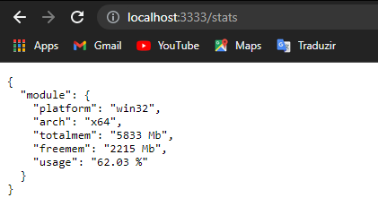
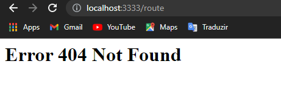
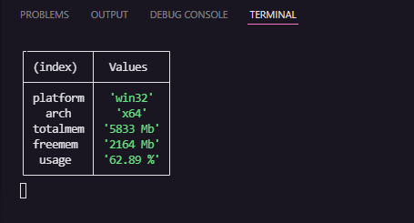

# Verificador de uso de memória RAM
&nbsp;
<h4 align="center"> 
	🚧  Verificador de RAM 🚀 Concluído! 🚧
</h4>
&nbsp;
<p>Aplicação fornece dados sobre o uso de memória RAM atualizados a cada segundo.</p>
&nbsp;

## 🏁 Tópicos

<!--ts-->
   * [Sobre](#verificador-de-uso-de-memória-ram)
   * [Tópicos](#-tópicos)
   * [Pré Requisitos](#pré-requisitos)
   * [Rodando o servidor](#rodando-o-servidor)
   * [Demonstração da Aplicação](#-demonstração-da-aplicação)
   * [Tecnologias](#tecnologias)
<!--te-->

&nbsp;
### Pré-requisitos

Antes de começar, você vai precisar ter instalado em sua máquina as seguintes ferramentas:
[Git](https://git-scm.com), [Node.js](https://nodejs.org/en/). 
Além disto é bom ter um editor para trabalhar com o código como [VSCode](https://code.visualstudio.com/)
&nbsp;
### 🎲 Rodando o servidor

```bash
# Clone este repositório
$ git clone <https://github.com/jleandrodev/ramUsage>

# Acesse a pasta do projeto no terminal/cmd
$ cd ramUsage

# Instale as dependências
$ npm install

# Execute a aplicação
$ npm start

# O servidor inciará na porta:3333 - acesse <http://localhost:3333>
```
&nbsp;
### 🚀 Demonstração da Aplicação

#### Acessando a rota '/':

&nbsp;
#### Acessando a rota '/stats':

&nbsp;
#### Acessando qualquer outra rota:

&nbsp;
#### Visualização pelo terminal do VS Code:

&nbsp;

### 🛠 Tecnologias

Este projeto foi construido com:

- [Node.js](https://nodejs.org/en/)
